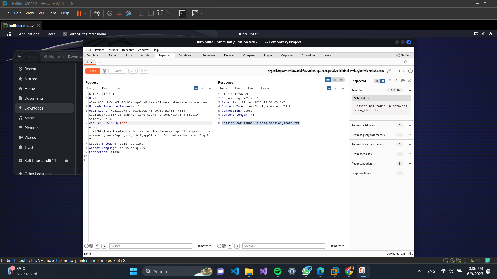
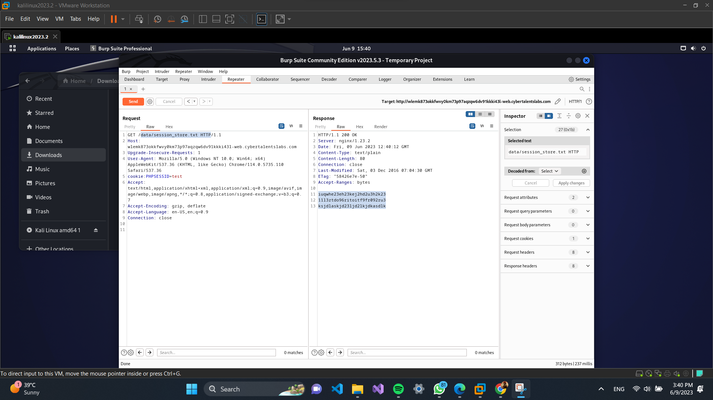

# Lesson 12: Burp Suite

> Lesson Link:\
> *[https://cybertalents.com/learn/introduction-to-cybersecurity/lessons/burp-suite](https://cybertalents.com/learn/introduction-to-cybersecurity/units/t-introduction-to-cybersecurity/lessons/burp-suite/challenges)*

## Introduction

In this lesson, we will learn about Burp Suite, and how can we use it to intercept and modify HTTP requests.

> ### What is Burp Suite?
>
> #### Burp Suite is an integrated platform for performing security testing of web applications. Its various tools work seamlessly together to support the entire testing process, from initial mapping and analysis of an application's attack surface, through to finding and exploiting security vulnerabilities

## Challenge

> Name:\
> *The Restricted Sessions*

---

> Description:\
> *Flag is restricted to logged users only , can you be one of them.*

## Solution

In this challenge, we have a website, and we need to be logged in to get the flag.

If we take a look at the source code of the website, we will find some javascript code.

```javascript
    if(document.cookie !== ''){
        $.post('getcurrentuserinfo.php',{
          'PHPSESSID':document.cookie.match(/PHPSESSID=([^;]+)/)[1]
        },function(data){
          cu = data;
        });
    }
```

So, we can see that the website is using `PHPSESSID` cookie to identify the user, lets try to set it to a random value.

Open Burp Suite, and go to `Proxy` tab, and click on `Intercept is on`, and click on `Options` tab, and click on `Target`, and add the website to the `Scope`, and click on `OK`.

Now, we need to set the `PHPSESSID` cookie to a random value, after the request is intercepted by Burp Suite, we can modify the request, and add the `PHPSESSID` cookie to the request, and send it.

After sending the request, we will a single-line html page that says:

```html
Session not found in data/session_store.txt
```

Now We now that the website is using a file called `data/session_store.txt` to store the sessions, so we need to find a way to get a valid session ID.

If we sent a request to `data/session_store.txt`, we will get a list of sessions, and we can try to use one of them.

After sending the request, we will get a list of sessions


, and we can try to use one of them. and send it to th `getcurrentuserinfo.php` file, and we will get some information about the user.

```bash
curl --form "PHPSESSID=[ANY_OF_THE_GIVEN_SESSION_IDS]" http://[YOUR_CHALLANGE_URL]/getcurrentuserinfo.php
```

the output will be something like this:

```json
{ 
    "name": "USERNAME",
    "email": "EMAIL",
    "session_id": "SESSION_ID"
}
```

We can use the `session_id` and set it as the `PHPSESSID` cookie, and send the request to the website, and we will get this page:

```html
UserInfo Cookie don't have the username , Validation failed
```

So, we can see that the website is using the `UserInfo` cookie to validate the user, and we need to set it to the username of the user that we got from the `getcurrentuserinfo.php` file.

After setting the `UserInfo` cookie to the username of the user, and sending the request, we will get the flag.

```html
Welcome to sessions valley
You are Loggedin
Flag: sessionareawesomebutifitsecure
```

## Flag

> sessionareawesomebutifitsecure

## References

- [https://www.wikiwand.com/en/Session_(computer_science)](https://www.wikiwand.com/en/Session_(computer_science))
