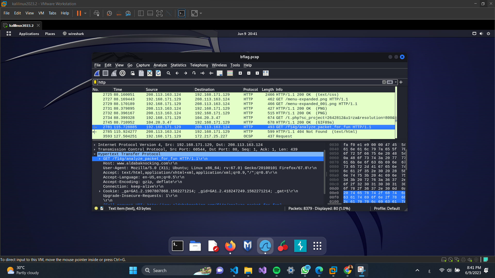

# Lesson 20: Wireshark

> Lesson Link:\
> *[https://cybertalents.com/learn/introduction-to-cybersecurity/lessons/20-wireshark](https://cybertalents.com/learn/introduction-to-cybersecurity/units/t-introduction-to-cybersecurity/lessons/20-wireshark/challenges)*

## Introduction

Wireshark is a network protocol analyzer. It lets you capture and interactively browse the traffic running on a computer network. It is used for network troubleshooting, analysis, software and communications protocol development, and education.

## Challenges

## Challenge 1

> Name:\
> *Capture*

---

> Description:\
> *Network analysis tool used to captured packets and present it in readable format*

## Solution 1

After a quick google search, we can find that the tool is called `wireshark`.

## Flag 1

> wireshark

## Challenge 2

> Name:\
> *bflag*

---

> Description:\
> *All of us started from the bottom. Now it's your turn.*

## Solution 2

We can use `wireshark` to open the `pcap` file, and then we can filter the packets by `http` to see the HTTP requests.

lets go through the requests and responses, We can see that the flag is in the `GET` request to `/f14g/analyze_packet_for_fun HTTP/1.1\r\n`.

## Flag 2

> analyze_packet_for_fun

## References

- [https://en.wikipedia.org/wiki/Wireshark](https://en.wikipedia.org/wiki/Wireshark)

- [https://www.wireshark.org/](https://www.wireshark.org/)
