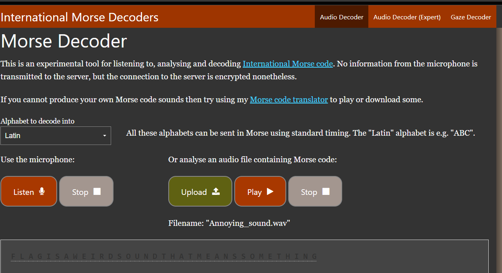

# Lesson 26: Morse Code

> Lesson Link:\
> *[https://cybertalents.com/learn/introduction-to-cybersecurity/lessons/26-morse-code](https://cybertalents.com/learn/introduction-to-cybersecurity/lessons/26-morse-code)*

## Introduction

Morse code is a method used in telecommunication to encode text characters as standardized sequences of two different signal durations, called dots and dashes or dits and dahs. Morse code is named for Samuel Morse, an inventor of the telegraph.

## Challenge

> Name:\
> *LOUDER*

---

> Description:\
> *My sales manager was annoyed by this sound. However my accountant thought it might mean something. Can you figure it out? P.S: submit flag in a single string

## Solution

In this challenge, we are given a .wav file. and we need to decode the morse code to get the flag.

We Can use [this](https://morsecode.world/international/decoder/audio-decoder-adaptive.html) website to decode the morse code.

After uploading the file, playing it, the website will decode the morse code to text. and we will get the following text:


```text
FLAGISAWEIRDSOUNDTHATMEANSSOMETHING
```

We can construct the flag from the text.

## Flag

> FLAGISAWEIRDSOUNDTHATMEANSSOMETHING
## References

- [https://morsecode.world/international/translator.html](https://morsecode.world/international/translator.html)

- [https://en.wikipedia.org/wiki/Morse_code](https://en.wikipedia.org/wiki/Morse_code)
