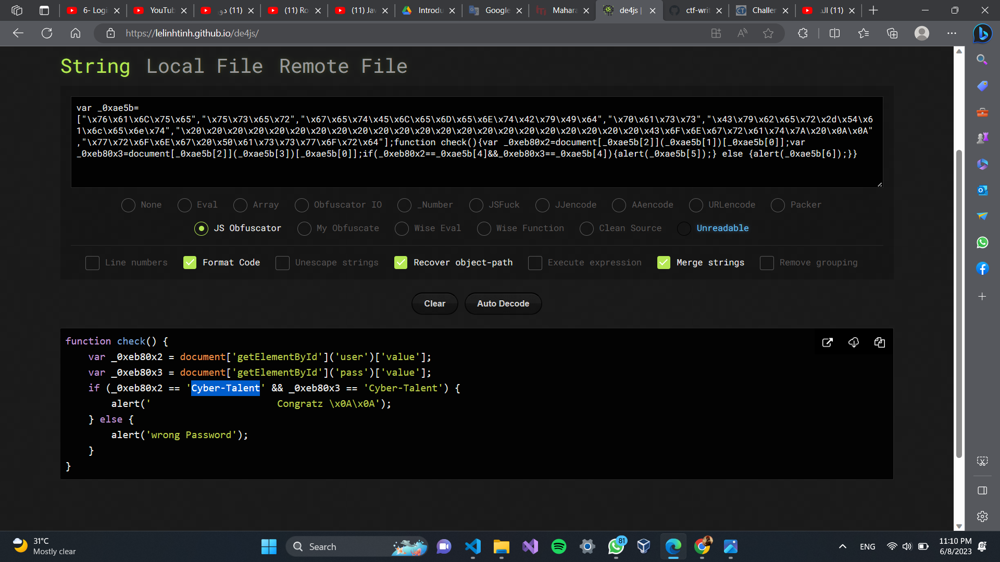

# Lesson 4: JavaScript

> Lesson Link:\
> *[https://cybertalents.com/learn/introduction-to-cybersecurity/lessons/4-javascript](https://cybertalents.com/learn/introduction-to-cybersecurity/units/t-introduction-to-cybersecurity/lessons/4-javascript/challenges)*

## Introduction

In this lesson, we will learn about JavaScript, some of the most common JavaScript functions, and how to use them. use javascript for xss.

## Challenge

> Name:\
> *This is Sparta.*

---

> Description:\
> *Morning has broken today they're fighting in the shade when arrows blocked the sun they fell tonight they dine in hell.*
---
> *FLAG Format:  {flagbody}*.

## Solution

In This Challenge, we will find a link to a website. the website contains a form that asks for a username and a password. if we enter any username and password, we will get a message that says `wrong user or password`.
if we look at the source code of the page, we will a script tag that contains a JavaScript code that looks wired. this is the code:

```javascript
var _0xae5b=["\x76\x61\x6C\x75\x65","\x75\x73\x65\x72","\x67\x65\x74\x45\x6C\x65\x6D\x65\x6E\x74\x42\x79\x49\x64","\x70\x61\x73\x73","\x43\x79\x62\x65\x72\x2d\x54\x61\x6c\x65\x6e\x74","\x20\x20\x20\x20\x20\x20\x20\x20\x20\x20\x20\x20\x20\x20\x20\x20\x20\x20\x20\x20\x20\x20\x43\x6F\x6E\x67\x72\x61\x74\x7A\x20\x0A\x0A","\x77\x72\x6F\x6E\x67\x20\x50\x61\x73\x73\x77\x6F\x72\x64"];function check(){var _0xeb80x2=document[_0xae5b[2]](_0xae5b[1])[_0xae5b[0]];var _0xeb80x3=document[_0xae5b[2]](_0xae5b[3])[_0xae5b[0]];if(_0xeb80x2==_0xae5b[4]&&_0xeb80x3==_0xae5b[4]){alert(_0xae5b[5]);} else {alert(_0xae5b[6]);}}
```

this code is obfuscated, so we can't read it easily. but we can use a tool to deobfuscate it. i used [this tool](https://lelinhtinh.github.io/de4js/). 

It will look something like this:


after deobfuscating the code, we will get this:

```javascript
function check() {
    var _0xeb80x2 = document['getElementById']('user')['value'];
    var _0xeb80x3 = document['getElementById']('pass')['value'];
    if (_0xeb80x2 == 'Cyber-Talent' && _0xeb80x3 == 'Cyber-Talent') {
        alert('                      Congratz \x0A\x0A');   //flag
    } else {
        alert('wrong Password');
    }
}
```

we can see that the code checks if the username and the password are equal to `Cyber-Talent`, if they are, we will get a message that says `Congratz`, otherwise, we will get a message that says `wrong Password`. so we can use this code to bypass the login form and get the flag.


## Flag

> {J4V4_Scr1Pt_1S_Aw3s0me}

## References

*Obfuscation is the process of making code difficult to understand, typically by means of deliberately confusing or misleading the reader. Obfuscation is used to protect intellectual property, to prevent reverse engineering, to protect trade secrets, and to make tampering with compiled code more difficult. Obfuscation is also used to make code more difficult to analyze, for example, by making it more difficult to perform static analysis or dynamic analysis. Obfuscation is often used in conjunction with encryption to protect the confidentiality of data. Obfuscation is also used to make code more difficult to understand, for example, by making it more difficult to read or to modify.*

if you are not familiar with obfuscation, you can read more about it [here](https://en.wikipedia.org/wiki/Obfuscation_(software)).
