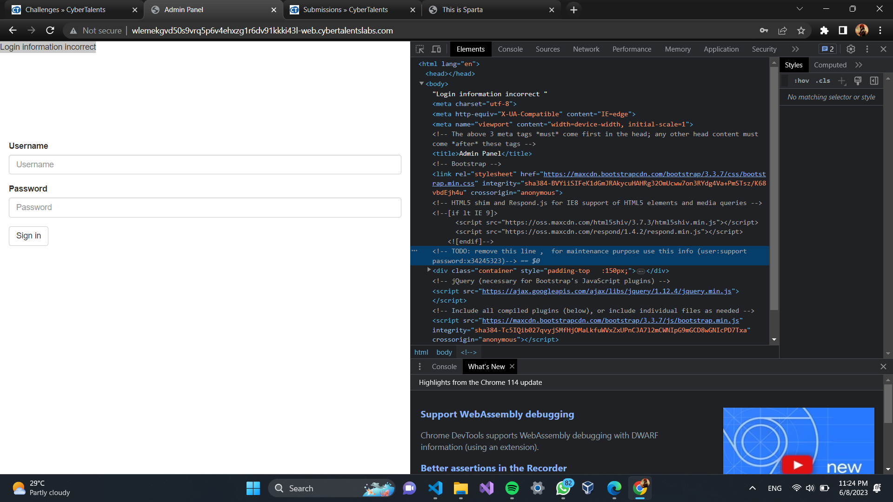

# Lesson 5: Cookies

> Lesson Link:\
> *[https://cybertalents.com/learn/introduction-to-cybersecurity/lessons/5-cookies](https://cybertalents.com/learn/introduction-to-cybersecurity/units/t-introduction-to-cybersecurity/lessons/sql-injection/challenges)*

## Introduction

In this lesson, we will learn about Cookies, how to use them, tools that you can use to manipulate them, and how to use them to bypass authentication.

## Challenge

> Name:\
> *Admin has the power.*

---

> Description:\
> *Administrators only has the power to see the flag , can you be one?*

## Solution

In this challenge, we are given a website that has a login page, and we need to login as an admin to see the flag.
the login page is very simple we just need to enter a username and a password, and we will get a message that tells us if we are logged in or not.

if we try to login with a random username and password, we will get a message that tells us `Login information incorrect`. so we need to find a valid username and password.

if we look at the source code of the login page, we will find a forgotten comment that says



```html
<!-- TODO: remove this line ,  for maintenance purpose use this info (user:support password:x34245323)-->
```

so we can use the username `support` and the password `x34245323` to login as an support user.

if we login as a support user, we will get a simple web page that tells us

```html
<h1>Hi support</h1>
<h3>Your privilege is support , may be you need better privilages !! </h3>
```

so we need to find a way to get a better privilege.

if we look at the cookies of the website, we will find a cookie called `role` that has a value of `support`.

so we can try to change the value of the `role` cookie to `admin` and see what happens.

if we change the value of the `role` cookie to `admin` and refresh the page, we will get a message that tells us


```html
<h1>Hi admin</h1>
<h3>Admin Secret flag : hiadminyouhavethepower</h3>
```

## Flag

> hiadminyouhavethepower

## References

*Cookies are small pieces of data that are stored on the user's computer by the web browser while browsing a website. Cookies were designed to be a reliable mechanism for websites to remember stateful information (such as items added in the shopping cart in an online store) or to record the user's browsing activity (including clicking particular buttons, logging in, or recording which pages were visited in the past). They can also be used to remember arbitrary pieces of information that the user previously entered into form fields such as names, addresses, passwords, and credit card numbers.*
*Cookies are widely used to make websites work, or work more efficiently, as well as to provide information to the owners of the site.*

If you are not familiar with cookies, you can read more about it [here](https://developer.mozilla.org/en-US/docs/Web/HTTP/Cookies).
