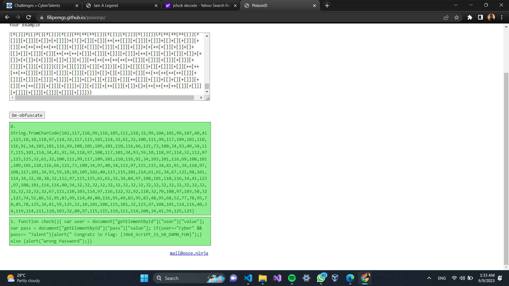

# Lesson 8: Obfuscation

> Lesson Link:\
> *[https://cybertalents.com/learn/introduction-to-cybersecurity/lessons/8-obfuscation](https://cybertalents.com/learn/introduction-to-cybersecurity/units/t-introduction-to-cybersecurity/lessons/8-obfuscation/challenges)*

## Introduction

In this lesson, we will learn about `Obfuscation`, and how to use it to hide our code from others.

## Challenges

this lesson contains 2 challenges:

### Challenge 1

> Name:\
> *Modify Code.*

---

> Description:\
> *Change code from one form to another to prevent attacker from understanding it*

### Challenge 1 Solution

In this challenge, we just need to do some research about `Obfuscation` and we will find that `Obfuscation` is a technique used to hide our code from others.

so the answer is `Obfuscation`.

### Challenge 2

> Name:\
> *Iam Legend.*

---

> Description:\
> *If I am a legend, then why am I so lonely?*\
> *Flag Format : FLAG{}*

### Challenge 2 Solution

In this challenge, We have a website contains a login form, and we can't login to it, so we need to find a way to bypass the login form.

if we take a look at the source code of the website, we will find some weird code that looks like this:

```javascript
[][[[]+[][+[]]][+[]][++[++[++[++[[]][+[]]][+[]]][+[]]][+[]]]+[[]+[][+[]]]...
```

What is this code?\
This code is a `Javascript` code that is `Obfuscated` in way that makes it hard to understand. it is called `JsFuck`.

so we can use [This Tool](https://filipemgs.github.io/poisonjs/) to evaluate the code we will get the following code:



```javascript
String.fromCharCode(102, 117, 110, 99, 116, 105, 111, 110, 32, 99, 104, 101, 99, 107, 40, 41, 123, 10, 10, 118, 97, 114, 32, 117, 115, 101, 114, 32, 61, 32, 100, 111, 99, 117, 109, 101, 110, 116, 91, 34, 103, 101, 116, 69, 108, 101, 109, 101, 110, 116, 66, 121, 73, 100, 34, 93, 40, 34, 117, 115, 101, 114, 34, 41, 91, 34, 118, 97, 108, 117, 101, 34, 93, 59, 10, 118, 97, 114, 32, 112, 97, 115, 115, 32, 61, 32, 100, 111, 99, 117, 109, 101, 110, 116, 91, 34, 103, 101, 116, 69, 108, 101, 109, 101, 110, 116, 66, 121, 73, 100, 34, 93, 40, 34, 112, 97, 115, 115, 34, 41, 91, 34, 118, 97, 108, 117, 101, 34, 93, 59, 10, 10, 105, 102, 40, 117, 115, 101, 114, 61, 61, 34, 67, 121, 98, 101, 114, 34, 32, 38, 38, 32, 112, 97, 115, 115, 61, 61, 32, 34, 84, 97, 108, 101, 110, 116, 34, 41, 123, 97, 108, 101, 114, 116, 40, 34, 32, 32, 32, 32, 32, 32, 32, 32, 32, 32, 32, 32, 32, 32, 32, 32, 32, 32, 32, 32, 32, 32, 67, 111, 110, 103, 114, 97, 116, 122, 32, 92, 110, 32, 70, 108, 97, 103, 58, 32, 123, 74, 52, 86, 52, 95, 83, 99, 114, 49, 80, 116, 95, 49, 83, 95, 83, 48, 95, 68, 52, 77, 78, 95, 70, 85, 78, 125, 34, 41, 59, 125, 32, 10, 101, 108, 115, 101, 32, 123, 97, 108, 101, 114, 116, 40, 34, 119, 114, 111, 110, 103, 32, 80, 97, 115, 115, 119, 111, 114, 100, 34, 41, 59, 125, 10, 10, 125)
```

if we evaluate this code using

```javascript
Console.log(String.fromCharCode(102, 117, 110, 99, 116, ...))
```

we will get the following code:

```javascript
function check() {

    var user = document["getElementById"]("user")["value"];
    var pass = document["getElementById"]("pass")["value"];

    if (user == "Cyber" && pass == "Talent") {
        alert("                      Congratz \n Flag: {J4V4_Scr1Pt_1S_S0_D4MN_FUN}");
    } else {
        alert("wrong Password");
    }

}
```

if we take a look at the code, we will find that the username is `Cyber` and the password is `Talent`, so we can login to the website and get the flag.

### Challenge 2 Flag

> FLAG{J4V4_Scr1Pt_1S_S0_D4MN_FUN}

## References

- [Obfuscation](https://en.wikipedia.org/wiki/Obfuscation_(software))
- [JsFuck](https://en.wikipedia.org/wiki/JsFuck)
- [Deobfuscate Javascript](https://lelinhtinh.github.io/de4js/)
- [Javascript Obfuscator](https://www.javascriptobfuscator.com/Javascript-Obfuscator.aspx)
