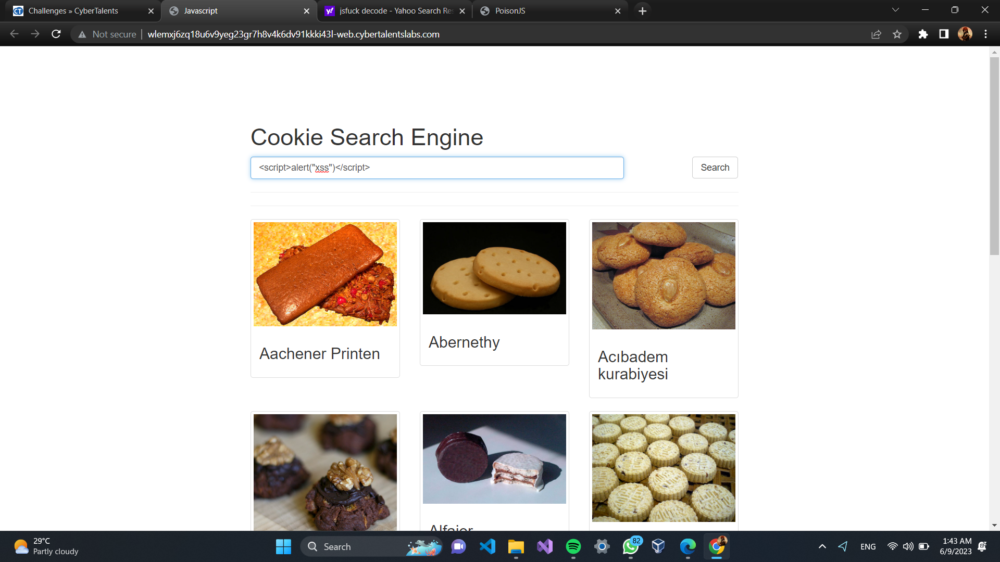

# Lesson 9: XSS

> Lesson Link:\
> *[https://cybertalents.com/learn/introduction-to-cybersecurity/lessons/9-xss](https://cybertalents.com/learn/introduction-to-cybersecurity/units/t-introduction-to-cybersecurity/lessons/9-xss/challenges)*

## Introduction

In this lesson, we will learn about XSS, how to exploit it, and how to prevent it.

## Challenge

> Name:\
> *Searching for the cookie.*

---

> Description:\
> *simple search website we need to know which cookie to eat ;)*

## Solution

In this challenge, we have a simple search website, it has a search box, and when we search for something, it will return the search results.

Now, we need to find a way to get the cookie, so we can do that by using `XSS`.

so, we will try to inject some `XSS` payload in the search box, like this:



```html
<script>alert("xss")</script>
```

and nothing happened, if we took a look at the source code, we will find this line:

```html
<script>var currentSearch = {'keyword':'you searched for: <script>alert("xss")</script>'};</script>
```

so, we might try to close the `script` tag before the `alert` function, like this:

```html
</script> <script>alert("xss")</script>
```

and we will get an alert that tells us `xss`.

so, we can try to get the cookie by using `document.cookie`, like this:

```html
</script> <script>alert(document.cookie)</script>
```

and we will get an alert that tells us the cookie. like this:

```html
x=try+to+execute+some+js+; flag=coolcookie112
```

## Flag

> coolcookie112

## References

- [https://www.w3schools.com/jsref/prop_doc_cookie.asp](https://www.w3schools.com/jsref/prop_doc_cookie.asp)

- [https://portswigger.net/web-security/cross-site-scripting](https://portswigger.net/web-security/cross-site-scripting)
